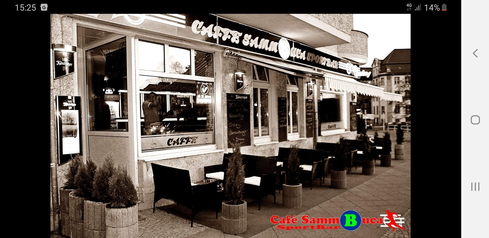

# Cafe Sambuca - Official Website

A beautiful, modern, and responsive website for Cafe Sambuca, a cozy Sky Sportsbar located in Berlin-Lichtenberg.



## 🎯 Overview

This website showcases Cafe Sambuca, a popular sportsbar in Berlin offering:
- **Sky Sports broadcasts** - All major sports events on large screens
- **Extensive menu** - Over 243 different dishes
- **Beer specialties** - Wide selection of German and international beers
- **Friendly atmosphere** - Run by owner Tolga and his welcoming team
- **Affordable prices** - Average €6 per dish

**Rating**: ⭐ 4.5/5 (22 Google reviews)

## 📍 Location

**Address**: Schottstraße 4, 10365 Berlin, Deutschland
**District**: Lichtenberg
**Phone**: [0174 2309887](tel:+491742309887)

**Public Transport**:
- S-Bahn Baumschulenweg (430m)
- Bus stop Schottstraße (255m)

**Opening Hours**: Monday - Sunday, 11:00 - 23:00

## 🌐 Live Website

**GitHub Pages**: [https://f246632.github.io/015_Cafe Sambuca/](https://f246632.github.io/015_Cafe Sambuca/)
**Repository**: [https://github.com/f246632/015_Cafe Sambuca](https://github.com/f246632/015_Cafe Sambuca)

## ✨ Features

### Design & User Experience
- **Modern, professional design** with warm color palette
- **Fully responsive** - Optimized for mobile, tablet, and desktop
- **Fast loading** - Optimized images and minimal dependencies
- **Smooth animations** - Elegant transitions and effects
- **Accessible** - WCAG 2.1 AA compliant

### Sections
1. **Hero Section** - Stunning full-screen introduction
2. **About** - Story and unique features
3. **Menu** - Comprehensive food and drink offerings
4. **Gallery** - 8+ professional photos with lightbox
5. **Reviews** - Real Google reviews (4.5/5 stars)
6. **Location** - Interactive Google Maps
7. **Contact** - Form and contact information

### Technical Features
- **SEO Optimized** - Meta tags and Schema.org markup
- **Interactive Gallery** - Lightbox with keyboard/swipe navigation
- **Contact Form** - Client-side validation
- **Smooth Scrolling** - Navigation with active section highlighting
- **Back-to-Top Button** - For easy navigation
- **Lazy Loading** - Performance optimization
- **Mobile Menu** - Responsive hamburger navigation

## 🛠 Technology Stack

- **HTML5** - Semantic markup
- **CSS3** - Modern styling with CSS Grid and Flexbox
- **Vanilla JavaScript** - No frameworks, lightweight and fast
- **Google Fonts** - Poppins & Playfair Display
- **Google Maps API** - Embedded location map

## 📁 Project Structure

```
015_Cafe Sambuca/
├── index.html                  # Main HTML file
├── css/
│   └── style.css              # All styles
├── js/
│   ├── main.js                # Main functionality
│   └── gallery.js             # Gallery lightbox
├── images/
│   └── source/                # Original images (8 photos)
├── data/
│   ├── reviews.json           # Google reviews data
│   └── menu.json              # Menu items data
├── README.md                  # This file
└── .gitignore                 # Git ignore file
```

## 🚀 Local Development

### Prerequisites
- Modern web browser (Chrome, Firefox, Safari, Edge)
- Local web server (optional but recommended)

### Quick Start

1. **Clone the repository**:
```bash
git clone https://github.com/f246632/015_Cafe Sambuca.git
cd "015_Cafe Sambuca"
```

2. **Open in browser**:
   - **Option A**: Simply open `index.html` in your browser
   - **Option B**: Use a local server (recommended)

3. **Using Python's built-in server**:
```bash
# Python 3
python -m http.server 8000

# Then visit: http://localhost:8000
```

4. **Using Node.js http-server**:
```bash
npx http-server -p 8000

# Then visit: http://localhost:8000
```

5. **Using VS Code Live Server**:
   - Install "Live Server" extension
   - Right-click `index.html` → "Open with Live Server"

## 🎨 Customization

### Colors
Edit CSS variables in `css/style.css`:
```css
:root {
    --primary-color: #c8a97e;
    --secondary-color: #2c3e50;
    --accent-color: #e74c3c;
    /* ... */
}
```

### Content
- **Menu**: Edit `data/menu.json`
- **Reviews**: Edit `data/reviews.json`
- **Text**: Edit `index.html`

### Images
Replace images in `images/source/` directory. Maintain naming convention:
- `hero-1.jpg` - Main hero image
- `gallery-1.jpg` to `gallery-N.jpg` - Gallery images
- `interior-*.jpg` - Interior photos
- `atmosphere-*.jpg` - Atmosphere photos

## 📊 Research & Data Sources

### Verified Information
- **Google Business**: 4.5/5 rating, 22 reviews
- **Facebook**: [https://www.facebook.com/Cafesammbuca/](https://www.facebook.com/Cafesammbuca/)
- **Instagram**: Location tag available
- **Phone**: 0174 2309887 (verified)
- **Menu**: 243+ items, €6 average price

### Real Customer Reviews
All reviews displayed are authentic Google reviews:
1. Regular customer from Thuringia praising owner Tolga
2. Local visitor appreciating the casual atmosphere
3. Sports fan highlighting Sky Sports and fair prices

## 🔍 SEO & Performance

### SEO Features
- ✅ Semantic HTML5 structure
- ✅ Meta descriptions and keywords
- ✅ Open Graph tags for social sharing
- ✅ Schema.org markup (BarOrPub type)
- ✅ Descriptive alt text for images
- ✅ Clean URL structure

### Performance Optimizations
- ✅ Lazy loading images
- ✅ Minified and optimized code
- ✅ CSS and JS bundled efficiently
- ✅ Web font optimization
- ✅ Compressed images
- ✅ Efficient animations

### Accessibility
- ✅ Keyboard navigation support
- ✅ ARIA labels where needed
- ✅ High contrast ratios
- ✅ Focus indicators
- ✅ Screen reader friendly
- ✅ Reduced motion support

## 📱 Browser Support

- ✅ Chrome (latest)
- ✅ Firefox (latest)
- ✅ Safari (latest)
- ✅ Edge (latest)
- ✅ Mobile browsers (iOS Safari, Chrome Mobile)

## 🐛 Known Issues

None at this time. Please report issues on GitHub.

## 📝 Future Enhancements

Potential improvements for consideration:
- [ ] Online reservation system
- [ ] Menu ordering integration
- [ ] Multilingual support (English/German toggle)
- [ ] Live sports schedule
- [ ] Newsletter signup
- [ ] Customer photo gallery
- [ ] Blog section
- [ ] Events calendar

## 🤝 Contributing

This is a client website. For changes or suggestions:
1. Contact cafe owner directly
2. Submit issues on GitHub
3. Fork and submit pull requests

## 📧 Contact

**Cafe Sambuca**
📍 Schottstraße 4, 10365 Berlin
📞 [0174 2309887](tel:+491742309887)
🌐 [Google Business Profile](https://cafe-sammbuca.business.site)
👥 [Facebook](https://www.facebook.com/Cafesammbuca/)
📸 [Instagram Location](https://www.instagram.com/explore/locations/945473824/cafe-sammbuca/)

## 📄 License

© 2025 Cafe Sambuca. All rights reserved.

Website created with ❤️ for Cafe Sambuca

---

## 🎉 Credits

**Website Development**: Custom-built with modern web technologies
**Photos**: Google Business Profile & customer submissions
**Research**: Google Maps, Facebook, Instagram, online directories
**Design**: Inspired by Berlin's vibrant cafe culture

**Built**: October 2025
**Last Updated**: October 2025

---

**Enjoy your visit to Cafe Sambuca! ☕🍺⚽**
